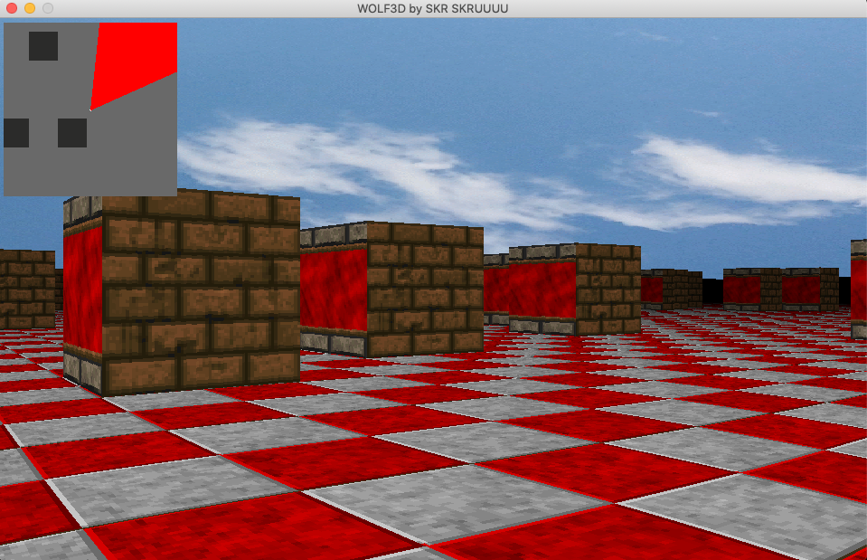

# Wolf3d

Wolf3d is a graphic project. The goal here is to create a simple game like Wolfenstein with the ray-casting method.

Short description:
- Maps are really simple, there are blocks of walls, the floor and two skyboxes
- We can move the player inside the labyrinth
- There is texture on walls according to orientation (N,S,W,E)
- There is texture on the floor

## Getting started

These instructions will get you a copy of the project up and running on your local machine for development and testing purposes.
We use a special graphic library here: minilibx

It's a graphic library from 42, it's very similar to SDL.

We've created this project on MAC OS so we can't guaranteed his well-functionning on other kernels.

### Installing
Clone the repository.

Launch make

```
bash> make
```

You should have an executable named wolf3d.

## Running the tests

There is another program to generate random maps in this project, in this example, we will see how to use it

### Example

Create a random map like this

```
bash> make create_map name_of_your_map
Put dimension on X-axis:
[Number 3:200]
Put dimension on Y-axis:
[Number 3:200]
Put position on X-axis:
[Number 64:64*(dim_X - 1) - 1]
Put position on Y-axis:
[Number 64:64*(dim_Y - 1) - 1]
Put the angle view:
[Number 0:359]
Put the density of the map:
[Number 0:100]
```

Note that the density of the map is correlated to the number of walls:
- 0 density: Only walls as boundaries
- 100 density: Only walls except on start position

Then, run wolf3d with the map as an argument

```
bash> ./wolf3d your_map
```

You should see something like this:<br/>

<br/>

Here is what you can do in the labyrinth:

- Move the player with arrow keys
- Sprint with the shift-left key pressed
- Starting/Stop rainfall with the key 'P'
- Increase or Decrease sensibility with 'Page_up' and 'Page_down'

Short demo video <br/>
<br/>

## Authors
* **Martin Siesse** [Msiesse](https://github.com/msiesse)
* **Cedric Audouy** [Ceaudouy](https://github.com/ceaudouy)

